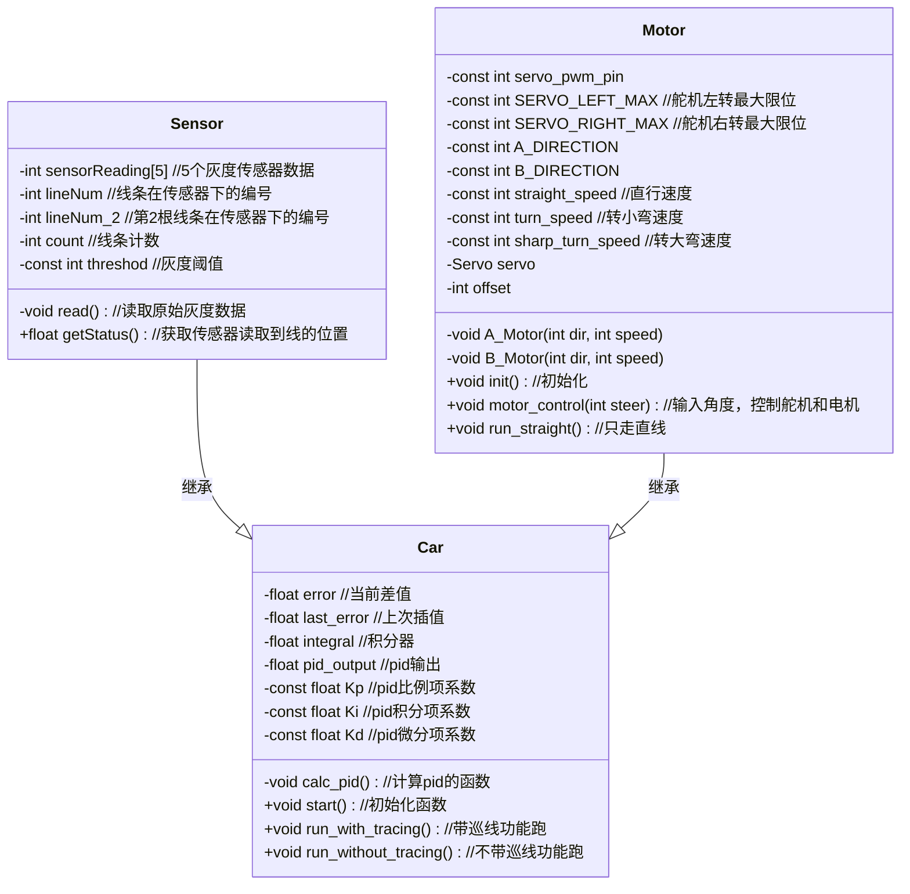
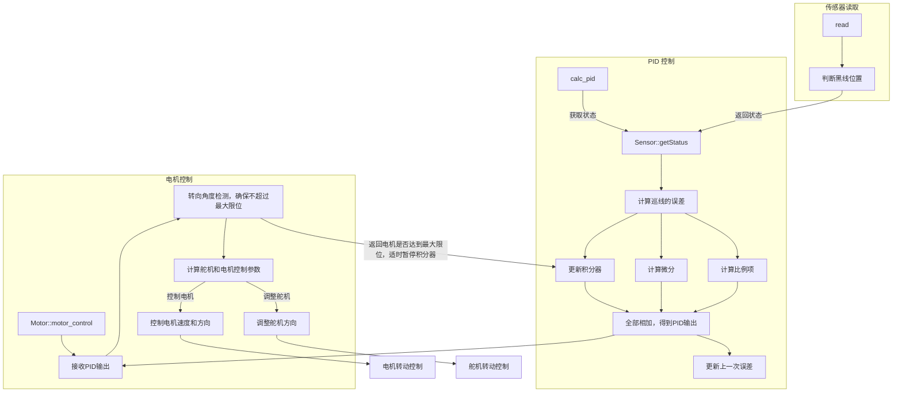

# lining-car
lining car code for SI1210
## branch introduction
- direct_control branch use some switches (if-else) to control the steering of the car
- pid branch use pid to calculate the steering of the car
## What is pid?
**P means Portion, I means integral, D means differentiation**\
discrete form of pid:
$$
u(k) = K_pe(t) + K_i \sum_{n=0}^k e(n) + K_d[e(k)-e(k-1)]
$$
## Some tips for tuning pid
```
参数整定找最佳，从小到大顺序查 
先是比例后积分，最后再把微分加 
曲线振荡很频繁，比例度盘要放大(Kp减小) 
曲线漂浮绕大湾，比例度盘往小扳(Kp增大)
曲线偏离回复慢，积分时间往下降(Ki增大)
曲线波动周期长，积分时间再加长(Ki减小)
曲线振荡频率快，先把微分降下来(Kd增大) 
动差大来波动慢。微分时间应加长(Kd减小) 
理想曲线两个波，前高后低4比1 
一看二调多分析，调节质量不会低
```

## 程序结构



